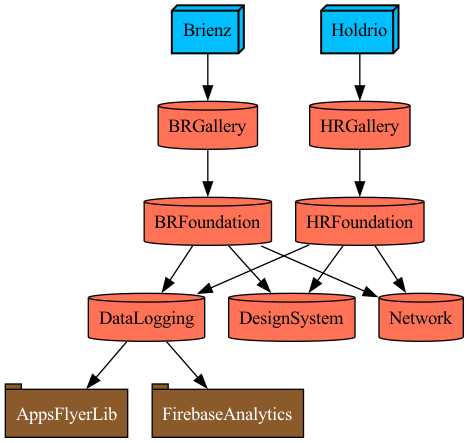

# Interaken
This project is an example of a modular structure that allows multiple apps to be developed within the same codebase. It is designed to facilitate streamlined development processes in an organization, ensuring consistency and efficiency across various applications. This project is configured through Tuist and the workspace needs to be generated using Tuist.

### Modular Architecture
The modular architecture of this project, along with the roles and characteristics of each layer, is as follows:

**Module**   
This module, which can be referenced from any layer—foundation, feature, or app—defines interfaces and delegates actual implementation to dependent modules. It supports the creation of modules that integrate third-party libraries, includes foundational app development utilities, and does not directly implement app-specific parts.

**Foundation**   
Referenced by the Feature layer and implements parts that are commonly applied across the app, allowing for reuse in multiple features.

**Feature**   
A layer separated based on services that include specific flows within the app.

**App**   
Integrates multiple features into a single app. When communication between features is necessary, it is implemented in this layer. It also handles the transitions and connections between different features.

### Graph   

</img>

### Reference
- https://github.com/baekteun/Tuist_Modular_Template
- https://techblog.yogiyo.co.kr/ios-프로젝트에-tuist-적용기-1d8f7d489252
- https://zuminternet.github.io/iOS-tuist-module/
- https://medium.com/daangn/tuist-를-활용해-모듈-구조-자동화하기-f200992d4bf2
- https://toss.tech/article/slash23-iOS?ref=codenary
